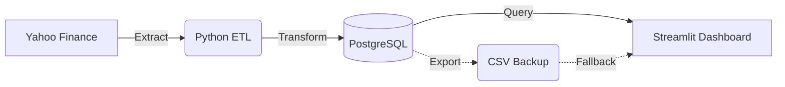

# S&P 500 Index (^GSPC) Automated Data Pipeline


[](https://sp500-automated-data-pipeline-hljdpfnxtokhtwerudtkpp.streamlit.app/)


**[🔴 LIVE DEMO](https://sp500-automated-data-pipeline-hljdpfnxtokhtwerudtkpp.streamlit.app/)** - Click to view the interactive dashboard

## Overview

A Data Engineering pipeline that automates the collection, processing, and visualization of S&P 500 stock market data. The project demonstrates end-to-end data engineering skills including ETL processes, database management, and interactive dashboards.

**Key Capabilities:**
- Automated daily data fetching from Yahoo Finance
- Data cleaning and technical indicator calculation (Moving Averages)
- PostgreSQL storage with CSV fallback for cloud deployment
- Interactive backtesting dashboard with investment simulation

## 🛠 Tech Stack

| Category | Technologies |
|----------|-------------|
| **Data Pipeline** | Python, Pandas, Prefect |
| **Data Source** | Yahoo Finance API |
| **Database** | PostgreSQL |
| **Visualization** | Streamlit |
| **Backtesting** | VectorBT |

## 📂 Project Structure

```
├── sp500_pipeline.py    # Main ETL pipeline (Extract → Transform → Load)
├── dashboard.py         # Streamlit web application
├── deploy_pipeline.py   # Prefect scheduling configuration
├── requirements.txt     # Python dependencies
└── sp500_market_data.csv # Cached data for demo mode
```

## 🚀 Getting Started

### Prerequisites
- Python 3.9+
- PostgreSQL (optional - CSV mode available)

### Installation

```bash
# Clone the repository
git clone https://github.com/ShirokumaB/sp500-automated-data-pipeline.git
cd sp500-automated-data-pipeline

# Install dependencies
pip install -r requirements.txt

# Set up environment variables (copy and edit)
cp .env.example .env
```

### Usage

```bash
# Run the data pipeline
python sp500_pipeline.py

# Launch the dashboard
streamlit run dashboard.py
```

## 📊 Dashboard Features

- **Market Trend Visualization** - Historical price data with SMA indicators
- **Strategy Backtesting** - Test SMA Crossover strategy with custom parameters
- **Investment Simulation** - Calculate hypothetical returns on $100,000 investment
- **Performance Metrics** - Total Return, Win Rate, Max Drawdown

## 🏗 Architecture



## 🔮 Future Improvements

- [ ] Docker containerization
- [ ] Cloud database migration (AWS RDS)
- [ ] Additional trading strategies
- [ ] Real-time data streaming
